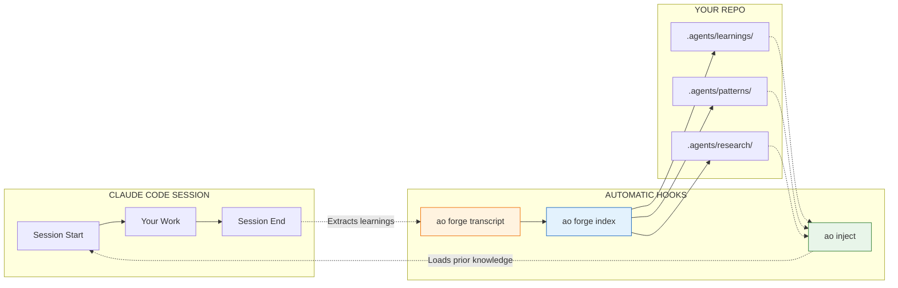
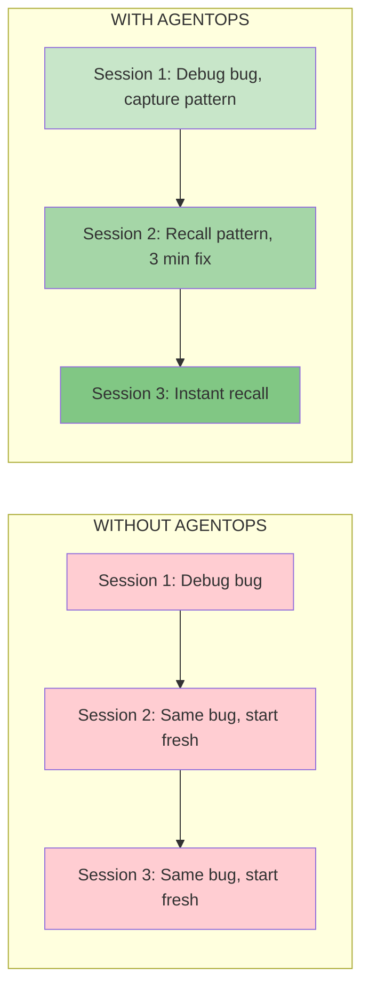

# AgentOps

**The Knowledge Engine for Claude Code**

> Stop starting from zero. Your agent learns, remembers, and compounds knowledge across sessions.

---

## The Problem

AI coding agents are brilliant but amnesiac. They solve a bug today, forget it tomorrow. You explain your architecture once, explain it again next week. Every session starts cold.

**AgentOps fixes this.** It gives your agent a persistent, git-tracked memory that compounds over time.

---

## The Workflow

**Chaos + Filter + Ratchet = Progress**

Each phase produces chaos, filters it for quality, then ratchets progress permanently. You can always add more chaos, but you can't un-ratchet.

```mermaid
flowchart TB
    %% Styles
    classDef research fill:#e3f2fd,stroke:#1565c0,stroke-width:2px,color:#0d47a1
    classDef plan fill:#f3e5f5,stroke:#7b1fa2,stroke-width:2px,color:#4a148c
    classDef implement fill:#fff3e0,stroke:#ef6c00,stroke-width:2px,color:#e65100
    classDef validate fill:#e8f5e9,stroke:#2e7d32,stroke-width:2px,color:#1b5e20
    classDef knowledge fill:#fce4ec,stroke:#c2185b,stroke-width:2px,color:#880e4f
    classDef auto fill:#eceff1,stroke:#546e7a,stroke-width:1px,stroke-dasharray: 5 5,color:#37474f
    classDef decision fill:#fff9c4,stroke:#f9a825,stroke-width:2px,color:#f57f17

    %% Main Workflow
    subgraph WORKFLOW["THE BROWNIAN RATCHET"]
        direction TB

        subgraph R["1. RESEARCH"]
            R1[Mine prior knowledge]
            R2[Explore codebase]
            R3[Create synthesis doc]
            R1 --> R2 --> R3
        end

        subgraph P["2. PLAN"]
            P1[Define spec]
            P2[Create beads issues]
            P3[Set dependencies]
            P1 --> P2 --> P3
        end

        subgraph PM["3. PRE-MORTEM"]
            PM1[Simulate N iterations]
            PM2[Find failure modes]
            PM3[Update spec]
            PM1 --> PM2 --> PM3
        end

        subgraph C["4. CRANK"]
            C1[Pick issue] --> C2[Implement]
            C2 --> C3{Vibe OK?}
            C3 -->|No| C2
            C3 -->|Yes| C4[Commit]
            C4 --> C5{More issues?}
            C5 -->|Yes| C1
            C5 -->|No| DONE[Done]
        end

        subgraph PO["5. POST-MORTEM"]
            PO1[Extract learnings]
            PO2[Run full vibe]
            PO3{Matches spec?}
            PO1 --> PO2 --> PO3
        end

        R3 --> P1
        P3 --> PM1
        PM3 --> C1
        DONE --> PO1
    end

    %% Validation Loop
    PO3 -->|No| C1
    PO3 -->|Yes| GOAL{Matches goal?}
    GOAL -->|No| R1
    GOAL -->|Yes| LOCK[RATCHET LOCKED]

    %% Knowledge Flywheel
    subgraph FLY["KNOWLEDGE FLYWHEEL"]
        direction LR
        LOCK --> INDEX[ao forge index]
        INDEX --> STORE[.agents/]
        STORE --> INJECT[ao inject]
        INJECT -.-> R1
    end

    %% Apply styles
    class R,R1,R2,R3 research
    class P,P1,P2,P3 plan
    class PM,PM1,PM2,PM3 validate
    class C,C1,C2,C3,C4,C5,DONE implement
    class PO,PO1,PO2,PO3 validate
    class GOAL,PO3,C3 decision
    class LOCK,INDEX,STORE,INJECT knowledge
```



---

## What Each Phase Does

| Phase | Chaos | Filter | Ratchet |
|-------|-------|--------|---------|
| **Research** | Multiple exploration paths | Human synthesis decision | `.agents/research/` artifact |
| **Plan** | Multiple plan attempts | Pre-mortem simulation | Beads issues with dependencies |
| **Pre-Mortem** | Simulate N failure modes | Identify spec gaps | Updated spec |
| **Crank** | Parallel polecats | Vibe validation (9 aspects) | Code merged to main |
| **Post-Mortem** | Multi-aspect validation | Spec comparison | Knowledge locked in flywheel |

---

## How It's Automated

You don't manually run `ao` commands. Hooks do it for you.



**SessionStart hook**: Injects relevant prior knowledge (weighted by freshness + utility)

**SessionEnd hook**: Extracts learnings and indexes them for future sessions

---

## The Escape Velocity Equation

Knowledge decays without reinforcement. But when retrieval × usage exceeds decay, knowledge compounds.



**The Math:**

```
dK/dt = I(t) - δK + σρK

Where:
  δ = 0.17/week    (knowledge decay rate)
  σ = retrieval effectiveness
  ρ = citation rate

Goal: σ × ρ > δ → Knowledge compounds faster than it fades
```

---

## Implementation Status

| Component | Status | Location |
|-----------|--------|----------|
| **ao CLI** | Implemented | `cli/` |
| **ao inject** | Implemented | Injects learnings at session start |
| **ao forge search** | Implemented | Searches CASS-indexed sessions |
| **ao forge index** | Implemented | Indexes artifacts for retrieval |
| **ao feedback** | Implemented | Helpful/harmful feedback loop |
| **ao ratchet** | Implemented | Provenance chain tracking |
| **/research** | Implemented | `skills/research/` |
| **/pre-mortem** | Implemented | `skills/pre-mortem/` |
| **/plan** | Implemented | `skills/plan/` |
| **/crank** | Implemented | `skills/crank/` |
| **/vibe** | Implemented | `skills/vibe/` |
| **/post-mortem** | Implemented | `skills/post-mortem/` |
| **Spec validation loop** | Implemented | In post-mortem |
| **Maturity tracking** | Partial | Schema designed |
| **Confidence decay** | Implemented | `ao inject --apply-decay` |

---

## Quick Start

```bash
# 1. Install
brew install boshu2/agentops/agentops

# 2. Connect to Claude Code
claude mcp add boshu2/agentops

# 3. Initialize your repo
ao init && ao hooks install

# 4. Verify
ao badge
```

---

## Storage Architecture

Everything lives in your repo. Portable, version-controlled, yours.

```
.agents/
  learnings/     # Extracted insights (with confidence + maturity)
  patterns/      # Reusable solutions
  research/      # Deep dive outputs
  retros/        # Session retrospectives
  deltas/        # Spec vs reality mismatches
  specs/         # Validated specifications
  ao/            # Search indices
```

---

## The Science

Built on peer-reviewed research, not vibes.

| Concept | Source | Finding |
|---------|--------|---------|
| **Knowledge Decay** | Darr, Argote & Epple (1995) | Organizational knowledge depreciates ~17%/week without reinforcement |
| **Memory Reinforcement** | Ebbinghaus (1885) | Each retrieval strengthens memory and slows future decay |
| **MemRL** | Zhang et al. (2025) | Two-phase retrieval (semantic + utility) enables self-evolving agents |

---

## Credits

Built on excellent open-source work:

| Tool | Author | What We Use | Link |
|------|--------|-------------|------|
| **beads** | Steve Yegge | Git-native issue tracking | [steveyegge/beads](https://github.com/steveyegge/beads) |
| **CASS** | Dicklesworthstone | Session indexing and search | [coding_agent_session_search](https://github.com/Dicklesworthstone/coding_agent_session_search) |
| **cass-memory** | Dicklesworthstone | Confidence decay, maturity tracking | [cass_memory_system](https://github.com/Dicklesworthstone/cass_memory_system) |
| **multiclaude** | dlorenc | The "Brownian Ratchet" pattern | [dlorenc/multiclaude](https://github.com/dlorenc/multiclaude) |

---

## Optional: Parallel Execution

For larger projects, **gastown** enables parallel agent execution:

```
/crank (single agent) --> gastown (multiple polecats in parallel)
```

Each polecat works in isolation. CI validates. Passing work merges. Failures don't cascade.

---

## License

MIT
