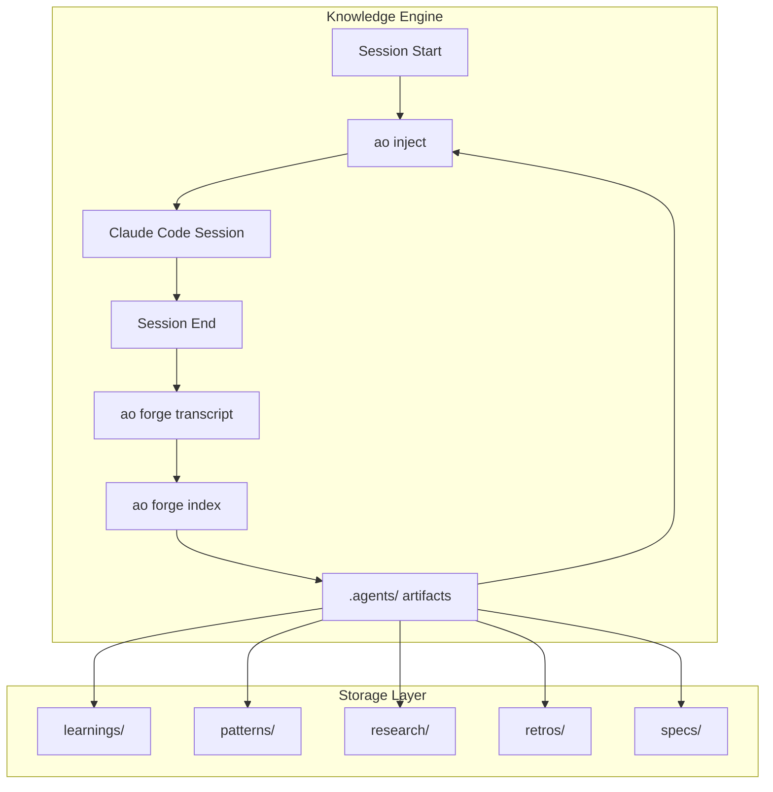
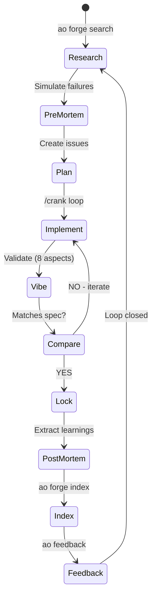
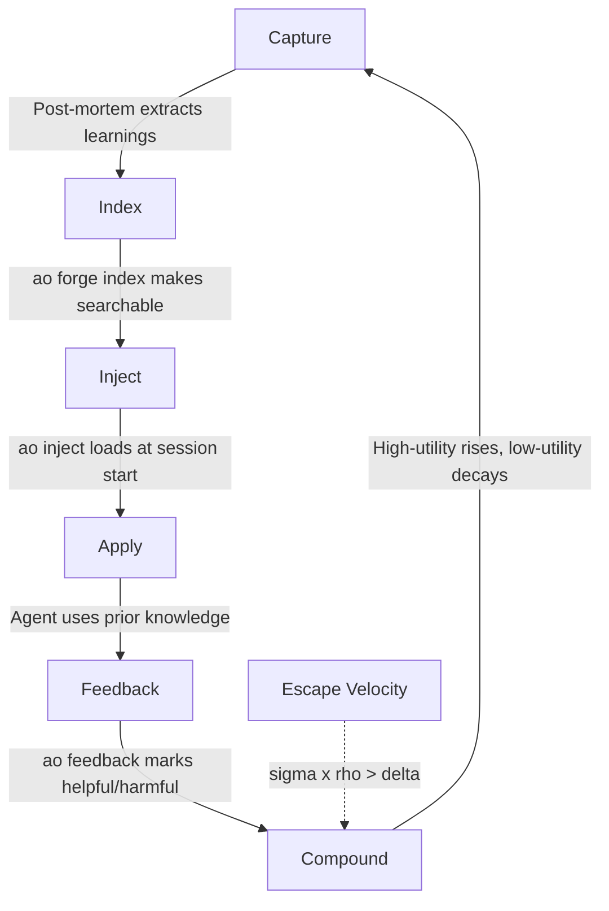

# AgentOps

**The Knowledge Engine for Claude Code**

> Stop starting from zero. Your agent learns, remembers, and compounds knowledge across sessions.

---

## The Problem

AI coding agents are brilliant but amnesiac. They solve a bug today, forget it tomorrow. You explain your architecture once, explain it again next week. Every session starts cold.

**AgentOps fixes this.** It gives your agent a persistent, git-tracked memory that compounds over time.

---

## Architecture



---

## The Workflow: Brownian Ratchet

**Chaos + Filter + Ratchet = Progress**

Each stage has a ratchet - progress locks in, never goes backward.



---

## Each Stage Explained

| Stage | Skill | What It Does | Output |
|-------|-------|--------------|--------|
| **Research** | `/research` | Mine prior knowledge, explore codebase, understand problem | `.agents/research/` |
| **Pre-Mortem** | `/pre-mortem` | Simulate failures BEFORE implementation. Find spec gaps. | Updated spec |
| **Plan** | `/plan` | Convert spec into tracked beads issues with dependencies | `.beads/` issues |
| **Implement** | `/crank` | Autonomous loop: pick issue, code, validate, commit, repeat | Merged code |
| **Vibe** | `/vibe` | Validate code quality (security, architecture, patterns, a11y, complexity, docs, tests, conventions) | Validation report |
| **Compare** | Built into post-mortem | Check vibe results vs spec goals. If mismatch, iterate or update spec. | `.agents/deltas/` |
| **Post-Mortem** | `/post-mortem` | Extract learnings, update specs, index to flywheel | `.agents/learnings/` |

---

## The Knowledge Flywheel

Knowledge flows in a loop. When retrieval times usage exceeds decay, knowledge compounds faster than it fades.



**The Equation:**

```
dK/dt = I(t) - delta * K + sigma * rho * K

Where:
  delta = 0.17/week (knowledge decay rate)
  sigma = retrieval effectiveness
  rho = citation rate (how often knowledge is used)

Goal: sigma x rho > delta = Knowledge compounds
```

---

## Implementation Status

| Component | Status | Location |
|-----------|--------|----------|
| **ao CLI** | Implemented | `cli/` |
| **ao inject** | Implemented | Injects learnings at session start |
| **ao forge search** | Implemented | Searches CASS-indexed sessions |
| **ao forge index** | Implemented | Indexes artifacts for retrieval |
| **ao feedback** | Implemented | Helpful/harmful feedback loop |
| **ao ratchet** | Implemented | Provenance chain tracking |
| **/research** | Implemented | `skills/research/` |
| **/pre-mortem** | Implemented | `skills/pre-mortem/` |
| **/plan** | Implemented | `skills/plan/` |
| **/crank** | Implemented | `skills/crank/` |
| **/vibe** | Implemented | `skills/vibe/` |
| **/post-mortem** | Implemented | `skills/post-mortem/` |
| **Spec validation loop** | Implemented | In post-mortem Phase 5.0 |
| **Maturity tracking** | Partial | Schema designed, transitions WIP |
| **Confidence decay** | Implemented | `ao inject --apply-decay` |

---

## Quick Start

```bash
# 1. Install
brew install boshu2/agentops/agentops

# 2. Connect to Claude Code
claude mcp add boshu2/agentops

# 3. Initialize your repo
ao init && ao hooks install

# 4. Verify
ao badge
```

---

## Storage Architecture

Everything lives in your repo. Portable, version-controlled, yours.

```
.agents/
  learnings/     # Extracted insights (with confidence + maturity)
  patterns/      # Reusable solutions
  research/      # Deep dive outputs
  retros/        # Session retrospectives
  deltas/        # Spec vs reality mismatches
  specs/         # Validated specifications
  ao/            # Search indices
```

---

## The Science

Built on peer-reviewed research, not vibes.

| Concept | Source | Finding |
|---------|--------|---------|
| **Knowledge Decay** | Darr, Argote & Epple (1995) | Organizational knowledge depreciates ~17%/week without reinforcement |
| **Memory Reinforcement** | Ebbinghaus (1885) | Each retrieval strengthens memory and slows future decay |
| **MemRL** | Zhang et al. (2025) | Two-phase retrieval (semantic + utility) enables self-evolving agents |

---

## Credits

Built on excellent open-source work:

| Tool | Author | What We Use |
|------|--------|-------------|
| **beads** | Steve Yegge | Git-native issue tracking | [steveyegge/beads](https://github.com/steveyegge/beads) |
| **CASS** | Dicklesworthstone | Session indexing and search | [coding_agent_session_search](https://github.com/Dicklesworthstone/coding_agent_session_search) |
| **cass-memory** | Dicklesworthstone | Confidence decay, maturity tracking concepts | [cass_memory_system](https://github.com/Dicklesworthstone/cass_memory_system) |
| **multiclaude** | dlorenc | The "Brownian Ratchet" pattern | [dlorenc/multiclaude](https://github.com/dlorenc/multiclaude) |

---

## Optional: Parallel Execution

For larger projects, **gastown** enables parallel agent execution:

```
/crank (single agent) --> gastown (multiple polecats in parallel)
```

Each polecat works in isolation. CI validates. Passing work merges. Failures don't cascade.

---

## License

MIT
